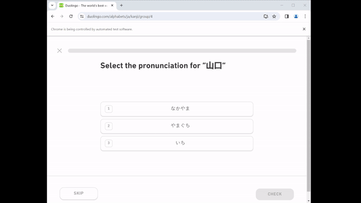

# Duolingo experience farm(Japanese only)
### Selenium python program to farm experience using kanji
Average speed - 60 seconds per lesson. Can differ depending on hardware
## Demo:

## How to use:
1. Download project and unzip it
2. Open cmd and go to project folder
3. Run ```python main.py```
4. New Chrome window will be opened where you need to login(session is saved, so you only need to do it once)
5. Enjoy the farm(you can minimise the Chrome window)